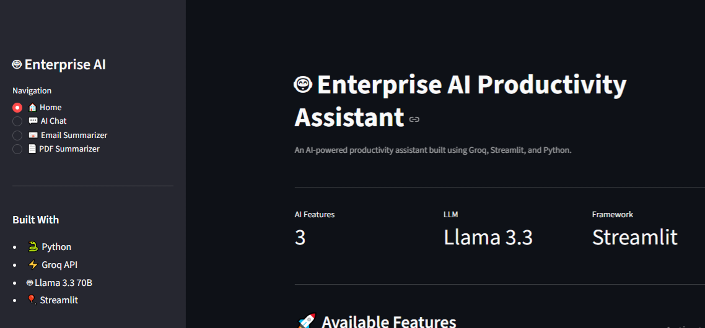
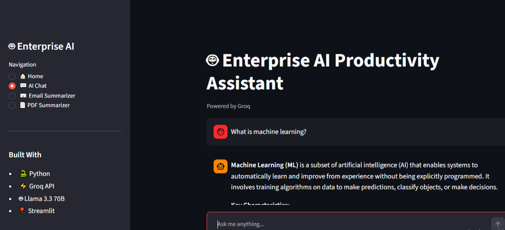
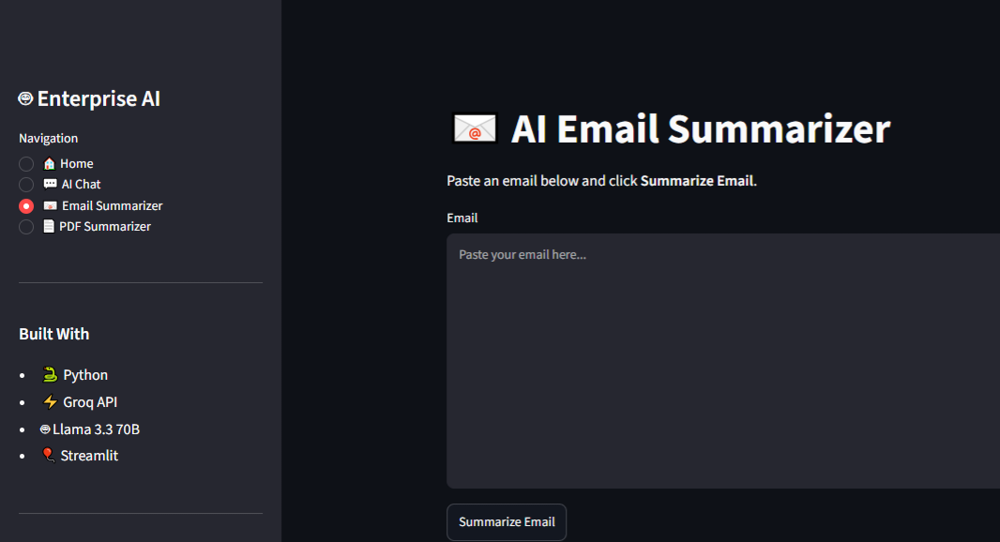
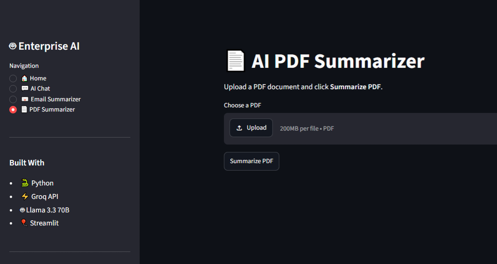

# 🤖 Enterprise AI Productivity Assistant

A modular Generative AI application built with **Python**, **Streamlit**, and the **Groq API** to help users interact with AI, summarize emails, and generate concise summaries from PDF documents.

---

## 📌 Project Overview

Enterprise AI Productivity Assistant is a lightweight AI-powered productivity application designed to simplify everyday tasks using Large Language Models (LLMs).

The application integrates the **Groq API** with the **Llama 3.3 70B Versatile** model to provide three core productivity features through an intuitive Streamlit interface:

- 💬 AI Chat
- 📧 Email Summarizer
- 📄 PDF Summarizer

The project follows a modular architecture by separating the user interface, business logic, and prompt templates into independent components. This design improves code readability, maintainability, and makes the application easier to extend with additional AI features in the future.

---

## 🎯 Objectives

The primary goals of this project were to:

- Build a real-world Generative AI application using an LLM API
- Apply modular software design principles
- Implement prompt engineering for different AI tasks
- Develop an interactive web application using Streamlit
- Process and summarize both emails and PDF documents

---

# 🚀 Features

### 💬 AI Chat

Interact with an AI assistant powered by the Groq API and the Llama 3.3 70B Versatile model.

**Key Capabilities**
- Multi-turn conversational AI
- Conversation history using Streamlit Session State
- Context-aware responses
- Modular chat service architecture

---

### 📧 Email Summarizer

Generate concise summaries from lengthy emails while highlighting the most important information.

**Key Capabilities**
- Summarizes long email conversations
- Identifies key discussion points
- Extracts action items
- Highlights important deadlines
- Download summary as a text file

---

### 📄 PDF Summarizer

Upload PDF documents and receive structured AI-generated summaries.

**Key Capabilities**
- PDF upload through Streamlit
- Text extraction using PyPDF
- AI-generated document summaries
- Download summary as a text file

---

## ✨ Technical Highlights

This project demonstrates:

- Modular application architecture
- REST API integration with the Groq API
- Prompt engineering using dedicated prompt templates
- Streamlit-based interactive web application development
- Environment variable management using `.env`
- Error handling for API and user input
- Session State for maintaining chat history
- Separation of UI, service, and prompt layers

---

# 🏗️ Project Architecture

The application follows a modular architecture that separates the user interface, business logic, AI prompt templates, and API integration into independent layers.

```text
                           User
                             │
                             ▼
                Streamlit User Interface
                             │
                             ▼
                           app.py
                             │
        ┌────────────┬────────────┬────────────┬────────────┐
        ▼            ▼            ▼            ▼
      Home         Chat        Email         PDF
      Page         Page     Summarizer    Summarizer
                             │
                             ▼
                      Service Layer
        ┌────────────┬────────────┬────────────┐
        ▼            ▼            ▼
   Chat Service  Email Service  PDF Service
                             │
                             ▼
                     Prompt Templates
                             │
                             ▼
                        Groq Client
                             │
                             ▼
                          Groq API
```

## Architecture Overview

The project is organized into multiple layers, each with a dedicated responsibility.

| Layer | Responsibility |
|--------|----------------|
| **UI Layer** | Handles user interaction through Streamlit pages |
| **Service Layer** | Processes user requests and communicates with the Groq API |
| **Prompt Layer** | Stores reusable prompt templates for different AI tasks |
| **Groq Client** | Manages API authentication and communication |
| **Groq API** | Generates AI responses using the Llama 3.3 70B Versatile model |

This layered architecture promotes separation of concerns by keeping the user interface, business logic, prompt engineering, and API integration independent. As a result, the application is easier to maintain, test, and extend with additional AI-powered features in the future.

---

# 📁 Project Structure

```text
Enterprise-AI-Assistant/
│
├── app.py                     # Application entry point
├── README.md                  # Project documentation
├── requirements.txt           # Project dependencies
├── .gitignore                 # Git ignore rules
│
├── assets/                    # Screenshots and project images
│
├── prompts/
│   ├── chat_prompts.py
│   ├── email_prompts.py
│   └── pdf_prompts.py
│
├── services/
│   ├── chat_service.py
│   ├── email_service.py
│   ├── groq_client.py
│   └── pdf_service.py
│
└── ui/
    ├── home_page.py
    ├── chat_page.py
    ├── email_page.py
    └── pdf_page.py
```

## Folder Responsibilities

| Folder | Purpose |
|---------|---------|
| **ui/** | Contains all Streamlit pages responsible for user interaction |
| **services/** | Implements the application's business logic and AI service integration |
| **prompts/** | Stores reusable prompt templates for different AI tasks |
| **assets/** | Stores screenshots and images used in the README |
| **app.py** | Entry point that manages application navigation and page routing |

---

# 🛠️ Technology Stack

| Technology | Purpose |
|------------|---------|
| **Python 3.10** | Core programming language used to develop the application |
| **Streamlit** | Builds the interactive web interface and manages user interaction |
| **Groq API** | Provides access to the Large Language Model for AI-powered responses |
| **Llama 3.3 70B Versatile** | Large Language Model used for chat and summarization tasks |
| **PyPDF** | Extracts text from uploaded PDF documents |
| **python-dotenv** | Securely loads environment variables from the `.env` file |
| **Git & GitHub** | Version control and project hosting |

## Technical Concepts Demonstrated

This project demonstrates practical implementation of the following software engineering and Generative AI concepts:

- Modular application architecture
- Large Language Model (LLM) integration
- Prompt engineering
- API integration
- Session state management
- PDF text extraction
- File upload handling
- Environment variable management
- Error handling
- Interactive web application development

---

# ⚙️ Installation & Setup

## 1. Clone the Repository

```bash
git clone https://github.com/your-username/Enterprise-AI-Assistant.git
```

Replace `your-username` with your GitHub username.

---

## 2. Navigate to the Project Directory

```bash
cd Enterprise-AI-Assistant
```

---

## 3. Create a Virtual Environment

### Windows

```bash
python -m venv .venv
```

### macOS / Linux

```bash
python3 -m venv .venv
```

---

## 4. Activate the Virtual Environment

### Windows (PowerShell)

```powershell
.\.venv\Scripts\Activate.ps1
```

### Windows (Command Prompt)

```cmd
.venv\Scripts\activate.bat
```

### macOS / Linux

```bash
source .venv/bin/activate
```

---

## 5. Install Required Packages

```bash
pip install -r requirements.txt
```

---

## 6. Configure Environment Variables

Create a file named `.env` in the project root directory and add your Groq API key:

```text
GROQ_API_KEY=your_api_key_here
```

---

## 7. Run the Application

```bash
streamlit run app.py
```

If the `streamlit` command is not recognized, run:

```bash
python -m streamlit run app.py
```

---

## 8. Open in Your Browser

After the application starts, Streamlit will display a local URL similar to:

```text
http://localhost:8501
```

Open the URL in your browser to use the application.

---

# 🚀 Future Improvements

The current version focuses on delivering core AI-powered productivity features through a modular architecture. Future enhancements may include:

- User authentication and personalized chat history
- Support for additional document formats (Word, Excel, and PowerPoint)
- Integration with multiple Large Language Models (LLMs)
- Conversation export as PDF or Markdown
- Cloud deployment using Streamlit Community Cloud or another cloud platform
- Docker support for simplified deployment
- Prompt customization and configurable AI settings
- OCR support for scanned PDF documents
- Retrieval-Augmented Generation (RAG) using external knowledge bases
- Voice-based interaction using Speech-to-Text and Text-to-Speech

---

# 📸 Application Preview

| Home | AI Chat |
|------|---------|
|  |  |

| Email Summarizer | PDF Summarizer |
|------------------|----------------|
|  |  |

---

# 🤝 Contributing

Contributions, suggestions, and improvements are welcome.

If you would like to contribute:

1. Fork the repository
2. Create a new feature branch
3. Commit your changes
4. Push your branch
5. Open a Pull Request

---

# 🙏 Acknowledgements

This project was built using the following open-source technologies and libraries:

- Python
- Streamlit
- Groq API
- Llama 3.3 70B Versatile
- PyPDF
- python-dotenv

Special thanks to the developers and open-source communities behind these technologies for making AI application development more accessible.

---

# 👨‍💻 Author

**Disha C**

Computer Science & Engineering Graduate

- GitHub: https://github.com/officialdishac
- LinkedIn: https://www.linkedin.com/in/dishacofficial/

If you found this project useful, consider giving it a ⭐ on GitHub.

---

# 📄 License

This project is licensed under the MIT License.

You are free to use, modify, and distribute this project under the terms of the MIT License.